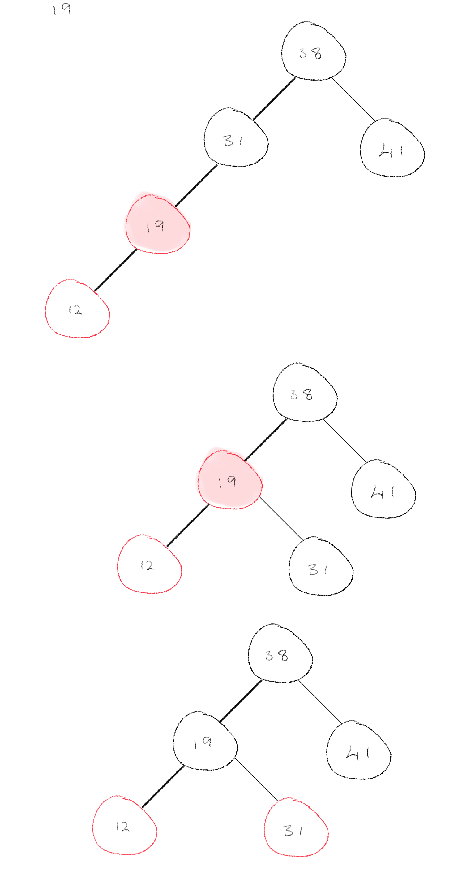
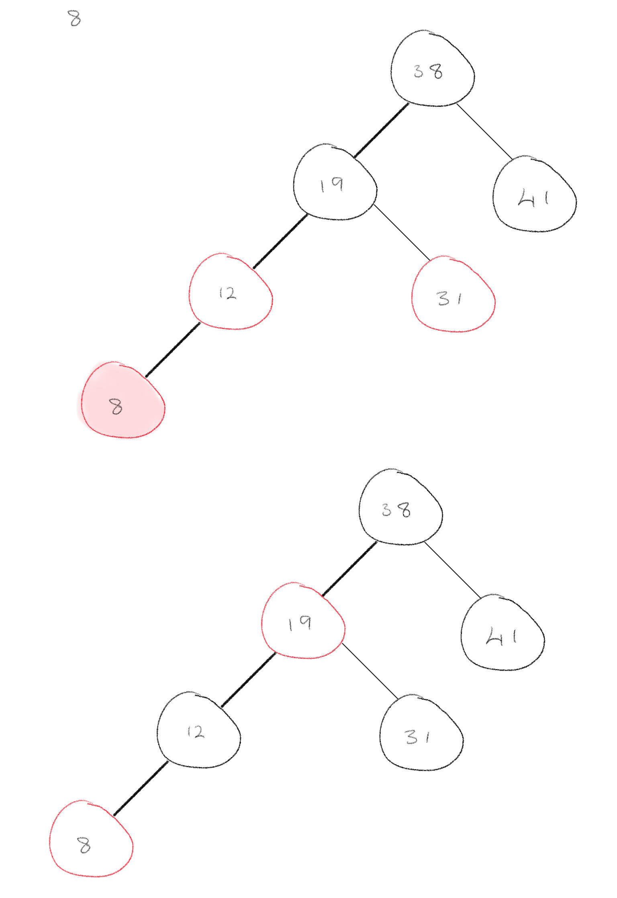

# Pre-class Work - Lesson 10.1

## Question 1 (Exercise 13.2-1, Cormen et al.)

**Write pseudocode for RIGHT-ROTATE.**

```
RIGHT-ROTATE(T, y)
    x = y.left          // set x
    y.left = x.right    // turn y's left subtree into x's right subtree
    IF x.right ≠ T.nil
        x.right.p = y
    x.p = y.p           // Link y's parent to x
    IF y.p == T.nil
        T.root = x
    ELSEIF y == y.p.right
        y.p.right = x
    ELSE y.p.left = x
    x.right = y         // Put y on x's right
    y.p = x
```

## Question 2 (Exercise 13.2-2, Cormen et al.)

**Argue that in every n-node binary search tree, there are exactly (n − 1) possible rotations.**

## Question 3 (Exercise 13.2-3, Cormen et al.)

**How do the depths of nodes in a BST change when a rotation is performed?**

## Question 4 (Exercise 13.3-2, Cormen et al.)

**Write down or illustrate the red-black trees that result after successively inserting the keys 41; 38; 31; 12; 19; 8 into an initially empty red-black tree.**

Cases:

0. Z = root -> color black
1. Z.uncle = red -> recolor grandparent, parent, and uncle
2. Z.uncle = black (triangle) -> rotate Z.parent
3. Z.uncle = black(line) -> rotate Z.grandparent and recolour grandparent, parent, and uncle


After inserting 41 case 0 occurs.


After inserting 31, case 3 occurs


After insering 12, case 1 occurs followed by case 0





After inserting 8, case 1 occurs