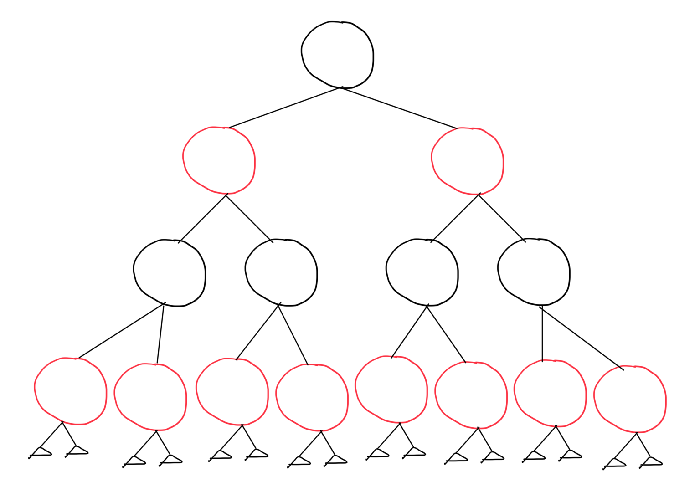

# Pre-class Work - Lesson 9.2

## Question 1 (Exercise 13.1-3 Cormen et al.)

**Let us define a relaxed red-black tree as a binary search tree that satisfies red-black properties 1, 3, 4, and 5. In
other words, the root may be either red or black. Consider a relaxed red-black tree T whose root is red. If we color
the root of T black but make no other changes to T , is the resulting tree a red-black tree?**

Yes, the result would be a red-black tree. To show it let's take an example of a soft red-black tree.

We then switch the _red_ root to be a _black_ root.

Let's see if it violates any of the 5 rules:

1. ✅ "Every node is either red or black.
2. ✅ The root is black.
3. ✅Every leaf (NIL) is black. [They are pointing to `T.nil` which is black]
4. ✅ If a node is red, then both its children are black.
5. ✅ For each node, all simple paths from the node to descendant leaves contain the same number of black nodes.”

Excerpt From: Thomas H. Cormen. “Introduction to Algorithms”. Apple Books. https://books.apple.com/us/book/introduction-to-algorithms/id570172300

## Question 2. (Exercise 13.1-4 Cormen et al.)

**Suppose that we “absorb” every red node in a red-black tree into its black parent, so that the children of the red
node become children of the black parent. (Ignore what happens to the keys.) What are the possible degrees of a
black node after all its red children are absorbed?**

When we absorb the children of a _red node_ to a its _black node_ parent, then it can either pass on its 1 or 2 children. While the _black node_ parent might be initially having 2 _red node_ children. Therefore, the _black node_ parent will end up with either 1, 2, 3 or 4 degrees.

## Question 3. (Exercise 13.1-5 Cormen et al.)

**Show that the longest simple path from a node x in a red-black tree to a descendant leaf has length at most twice
that of the shortest simple path from node x to a descendant leaf.**

The shortest path is also known as _bh_ or _black height_. The _height_ of a tree will utmost be twice the _black height_.

The shortest tree would be having the following tree with only black nodes.

However, when we insert red nodes, then the maximum would be the following tree.

Therefore, the shortest as we can see has a _height_ of 2 and a _bh_ of 2 as well.
The longest one has a _bh_ of 2 but a _height_ of 4.

## Question 4. (Exercise 13.1-6 Cormen et al.)

**What is the largest possible number of internal nodes in a red-black tree with blackheight k? What is the smallest
possible number?**

As we explored in the previous question, we notice that the _height_ will be at max double _black height_. Therefore, if k is the number of black nodes then the smallest number of nodes will be (2^k - 1) while the longest would be (2^(2k) - 1).

## Question 5. Left-Right Balance

**We can define the left-right balance of a binary search tree as the ratio of the number of nodes in the left subtree
to the number of nodes in the right. Answer the following questions:**

1. **If a BST can be successfully colored red-black, then find bounds on the left-right balance of that tree, or prove
why there is no bound on the left-right balance of that tree.**

The left-right balance would have to exist when both sides have equal _black heights_.

2. **Does your answer change as the number of nodes in the tree increases? Explain.**

As we increase the number of nodes, we just have to distribute them equally to the left and right sides.
